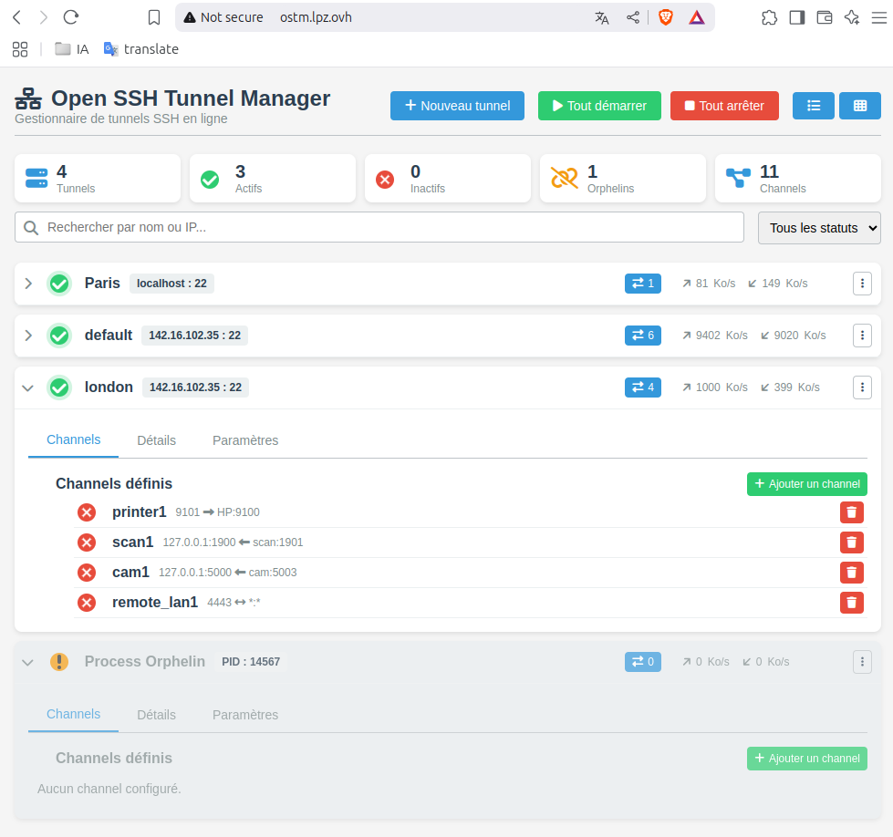

# **OSTM : Open SSH Tunnels Manager**

**OSTM** est une application Node.js conçue pour gérer des tunnels SSH persistant avec limitation de pande passante à l’aide d’**autossh** et **trickle**. Elle permet de créer, superviser et contrôler des tunnels SSH via une API RESTful et une interface web intuitive.

## **Table des matières**
1. [Introduction](#introduction)
2. [Fonctionnalités](#fonctionnalités)
3. [Technologies](#technologies)
4. [Installation](#installation)
5. [Configuration](#configuration)
6. [Utilisation de l'API](#utilisation-de-lapi)
7. [Interface Web](#interface-web)
8. [Sécurité](#sécurité)
9. [Exemples de commandes](#exemples-de-commandes)
10. [Contribution](#contribution)
11. [Licence](#licence)

---

## **Introduction**
**OSTM** (Open SSH Tunnels Manager) est un outil puissant pour gérer des tunnels SSH, qu’il s’agisse de transferts de ports locaux (`-L`), distants (`-R`) ou dynamiques (`-D`). Il offre une interface web pour une gestion simplifiée et une API pour une intégration avancée. L’application est idéale pour les administrateurs système cherchant à superviser des connexions sécurisées avec un contrôle précis de la bande passante.

---

## **Fonctionnalités**
- **Gestion des tunnels** : Démarrer, arrêter ou redémarrer des tunnels SSH individuellement ou en masse.
- **Supervision en temps réel** : Vérifier l’état des tunnels (actifs, inactifs, orphelins) et des connexions SSH.
- **Configuration flexible** : Définir des tunnels via des fichiers JSON dans `/config/sites/`.
- **Transferts de ports** : Support des options `-L`, `-R` et `-D` pour des configurations variées.
- **Contrôle de la bande passante** : Limiter les débits upload/download avec **trickle**.
- **Interface web intuitive** : Gérer les tunnels sans ligne de commande, avec des statistiques de trafic (upload/download).
- **API RESTful** : Automatiser la gestion des tunnels via des endpoints bien définis.
- **Sécurité renforcée** : Gestion des clés SSH et validation des entrées pour éviter les injections.

---

## **Technologies**
- **Backend** : Node.js + Express
- **Gestion des processus** : `child_process` pour exécuter les commandes SSH
- **Tunnels SSH** : `autossh` pour des connexions persistantes
- **Contrôle de la bande passante** : `trickle` pour limiter les débits
- **Configuration** : Fichiers JSON (un par tunnel, dans `/src/config/tunnels/`)
- **Interface web** : frontend HTML, JS et CSS natif

---

## **Installation**
Pour installer et lancer **OSTM**, suivez ces étapes :

1. **Clonez le dépôt** :
   ```bash
   git clone https://github.com/sctfic/Open-Ssh-Tunnel-Manager.git
   cd ostm
   ```

2. **Installez les dépendances** :
   ```bash
   npm install
   ```

3. **Configurez les variables d’environnement** (optionnel) :
   un fichier `.env` est défini, le port de l’API y est specifié PORT=4000

4. **Démarrez l’application** :
   ```bash
   npm start
   ```

L’interface web sera accessible par défaut à `http://localhost:4000` (ou le port configuré).

---

## **Configuration**
Les tunnels sont configurés via des fichiers JSON dans le dossier `/src/config/tunnels/`. Chaque fichier est nommé `id.json` (par exemple, `paris.json`) et contient les détails du tunnel. Voici un exemple de configuration :

```json
{
    "user": "remote_ssh_user",
    "ip": "remote_ssh_serveur",
    "ssh_port": 22,
    "ssh_key": "/home/user/www/ostm/src/configs/key/Paris_key",
    "options": {
        "compression": "yes",
        "ServerAliveInterval": 10,
        "ServerAliveCountMax": 3
    },
    "bandwidth": {
        "up": 100,
        "down": 500
    },
    "channels": {
        "-L": {
            "9101": {
                "name": "printer1",
                "listen_port": 9101,
                "endpoint_host": "HP",
                "endpoint_port": 9100
            },
            "9102": {
                "name": "printer2",
                "listen_port": 9102,
                "endpoint_host": "xerox",
                "endpoint_port": 9100
            }
        },
        "-R": {
            "1901": {
                "name": "scan1",
                "listen_port": 1901,
                "listen_host": "scan",
                "endpoint_host": "127.0.0.1",
                "endpoint_port": 1900
            },
            "5003": {
                "name": "cam1",
                "listen_port": 5003,
                "listen_host": "cam",
                "endpoint_host": "127.0.0.1",
                "endpoint_port": 5000
            }
        },
        "-D": {
            "4443": {
                "name": "remote_lan1",
                "listen_port": 4443
            }
        }
    }
}
```

### **Explications des champs**
- `user` : Utilisateur SSH.
- `ip` : Adresse IP du serveur SSH.
- `ssh_port` : Port SSH (par défaut 22).
- `ssh_key` : Chemin vers la clé SSH.
- `options` : Options SSH comme `ServerAliveInterval` pour maintenir la connexion.
- `bandwidth` : Limites de bande passante (en Kbps).
- `channels` : Liste des transferts de ports (`-L`, `-R`, `-D`).

---

## **Utilisation de l'API**
L’API RESTful permet de gérer les tunnels de manière programmatique. Voici les principaux endpoints (détails complets dans `docs/api.md`) :

| Endpoint                     | Méthode | Description                                  |
|------------------------------|---------|----------------------------------------------|
| `/api/v1/tunnels/start`      | `GET`   | Démarre tous les tunnels                     |
| `/api/v1/tunnels/start/:id`  | `GET`   | Démarre un tunnel spécifique                 |
| `/api/v1/tunnels/stop`       | `GET`   | Arrête tous les tunnels                      |
| `/api/v1/tunnels/stop/:id`   | `GET`   | Arrête un tunnel spécifique                  |
| `/api/v1/tunnels/restart`    | `GET`   | Redémarre tous les tunnels                   |
| `/api/v1/tunnels/status`     | `GET`   | Renvoie l’état de tous les tunnels           |
| `/api/v1/channel/add/:id`    | `POST`  | Ajoute un port forward (`-L`, `-R`, `-D`)    |
| `/api/v1/channel/rm/:id/:type/:port` | `DELETE` | Supprime un port forward             |
| `/api/v1/tunnels/bandwidth/:id` | `POST` | Modifie la bande passante d’un tunnel     |
| `/api/v1/pairing/plug`       | `POST`  | Crée une config et génère une clé SSH        |
| `/api/v1/pairing/unplug/:id` | `DELETE`| Supprime un tunnel et sa clé SSH distante    |

### **Exemple : Ajouter un port forward**
```bash
curl -X POST http://localhost:3000/api/v1/channel/add/paris \
  -H "Content-Type: application/json" \
  -d '{"type": "-L", "name": "printer1", "listen_port": 9101, "endpoint_host": "HP", "endpoint_port": 9100}'
```

**Réponse :**
```json
{
    "success": true,
    "message": "Port ajouté",
    "result": {
        "success": true,
        "tunnelId": "paris",
        "config": {
            "name": "printer1",
            "listen_port": 9101,
            "endpoint_host": "HP",
            "endpoint_port": 9100
        },
        "message": "Port 9101 ajouté avec succès"
    }
}
```

Consultez `docs/api.md` pour des exemples détaillés de tous les endpoints.

---

## **Interface Web**
L’interface web, accessible à `http://localhost:4000`, permet de gérer les tunnels sans ligne de commande. Voici ses principales fonctionnalités (basées sur la capture d’écran) :

- **Vue d’ensemble** : Affiche le nombre total de tunnels (4), tunnels actifs (3), inactifs (0), orphelins (1), et processus (11).
- **Liste des tunnels** : Chaque tunnel (ex. "Paris", "default", "london") montre son état (actif/inactif), son serveur SSH, son PID, et les statistiques de trafic (upload/download).
- **Actions globales** : Boutons "Tout démarrer" et "Tout arrêter" pour gérer tous les tunnels en une fois.
- **Actions par tunnel** : Options pour voir les détails, modifier les paramètres (ex. bande passante), ou ajouter/supprimer des canaux.
- **Canaux définis** : Liste des canaux configurés (ex. `printer1`, `scan1`, `cam1`) avec leur état (actif/inactif) et un bouton pour les supprimer.
- **Processus orphelins** : Affiche les processus non gérés avec leurs statistiques.
- **Recherche** : Filtrer les tunnels par nom ou IP.

<!-- image  -->


## **Sécurité**
- **Validation des entrées** : Les fichiers JSON et les requêtes API sont validés pour éviter les injections de commandes.
- **Clés SSH** : Génération sécurisée avec `ssh-keygen` et distribution via `ssh-copy-id`.
- **Connexion non sécurisée** : L’interface web affiche un avertissement "Not secure" (vu dans la capture d’écran). Il est recommandé d’activer HTTPS pour une utilisation en production.
- **Authentification** : À implémenter pour sécuriser l’accès à l’API et à l’interface web.

---

## **Exemples de commandes générées**

### **Tunnel mixte (`-L` et `-R`)**
```bash
trickle -u 1000 -d 5000 autossh -M 0 -N -o ServerAliveInterval=10 \
  -i /path/to/key -L 9101:HP:9100 -L 9102:xerox:9100 -R 5003:127.0.0.1:5000 alban@localhost -p 22
```

### **Reverse tunnel (`-R`)**
```bash
trickle -u 1000 -d 5000 autossh -M 0 -N -o ServerAliveInterval=10 \
  -i /path/to/key -R 1901:127.0.0.1:1900 -R 5003:127.0.0.1:5000 alban@localhost -p 22
```

### **Dynamic tunnel (`-D`)**
```bash
trickle -u 1000 -d 5000 autossh -M 0 -N -o ServerAliveInterval=10 \
  -i /path/to/key -D 4443 alban@localhost -p 22
```

---

## **Contribution**
Pour contribuer à **OSTM** :
1. Forkez le projet.
2. Créez une branche pour votre fonctionnalité :
   ```bash
   git checkout -b feature/nouvelle-fonction
   ```
3. Committez vos modifications :
   ```bash
   git commit -am 'Ajout de nouvelle fonctionnalité'
   ```
4. Poussez votre branche :
   ```bash
   git push origin feature/nouvelle-fonction
   ```
5. Ouvrez une Pull Request sur GitHub.

---

## **Licence**
Ce projet est distribué sous la licence [MIT](LICENSE). Vous êtes libre de l’utiliser, le modifier et le redistribuer selon ses termes.

---

Ce `README.md` est conçu pour être clair et complet, tout en intégrant les informations des documents joints et de la capture d’écran. Si vous avez besoin d’ajustements ou de sections supplémentaires, faites-le-moi savoir !