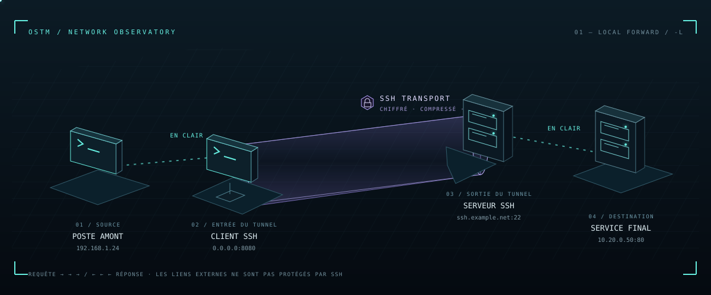

# Open SSH Tunnel Manager

Backend Node.js : API authentifiée, droits cumulés par tunnel, redirections SSH
`-L`, `-R` et SOCKS5 (`-D`), reconnexion, clés et événements SSE en temps réel.
Frontend sombre en HTML, CSS et JavaScript natifs, servi sans compilation.

## Visualisation du transport SSH

[](svg.html)

L'illustration montre le chemin complet d'une redirection `-L` : le trafic
circule en clair entre les équipements et les deux extrémités SSH, puis il est
chiffré, compressé et limité pendant son passage dans le tunnel. Les réponses
empruntent le même chemin en sens inverse. [Ouvrir la visualisation interactive
des modes `-L`, `-R` et SOCKS](svg.html).

- [API et exemples](docs/backend-api.md)
- [Installation Linux, Nginx et PM2](docs/deployment.md)
- [Décisions fonctionnelles](docs/rebuild-decisions.md)
- [Installation de test sur rpi3.lan](docs/test-host-rpi3.md)
- [Guide d'intégration des développeurs](docs/developer-guide.md)
- [Architecture du frontend Vanilla JS](docs/frontend.md)

## Démarrage local

Node.js >= 22. Une seule instance par répertoire de données.

```powershell
npm ci
$env:OSTM_NETWORK_MODE = 'direct'
npm start
```

Ouvrir `http://127.0.0.1:4000` puis définir le mot de passe root de votre choix lors de la
première connexion. La commande `npm run bootstrap` reste disponible pour une
initialisation automatisée. Le mode `direct` permet de développer sous
Windows ou Linux : il mesure les octets SSH chiffrés mais refuse les limites non
nulles. En production, utiliser le mode `linux`, par défaut, avec son helper réseau.

Les données privées sont écrites dans `data/`, ignoré par Git. Les exemples de
`configs/` ne sont ni importés ni démarrés automatiquement. Créer les tunnels avec
la nouvelle API et une empreinte SHA-256 vérifiée du serveur distant.

## Vérification

```sh
npm test
```

La suite teste les droits et de vrais échanges SSH locaux pour les trois types de
channel. Le test réseau privilégié est désactivé par défaut. Sur un hôte Linux de
test préparé selon le guide de déploiement :

```sh
sudo env OSTM_LINUX_INTEGRATION=1 node --test tests/network-linux.test.js
```

Ce test crée temporairement une interface, un espace réseau et des règles
iptables dédiés, vérifie les plafonds Up/Down puis les retire.
